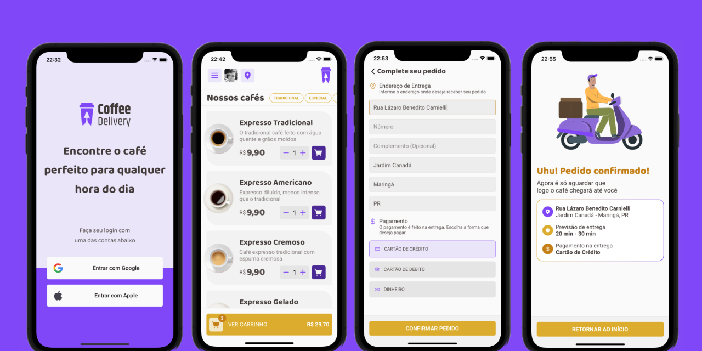

# Coffee Delivery ☕

Coffee Delivery é um aplicativo para encomenda de cafés.
O projeto é uma adaptação de um desafio de desenvolvimento para Web proposto pela [Rocketseat](https://github.com/Rocketseat), foi produzido utilizando conceitos básicos de React Native.

<a href="https://www.figma.com/file/F3qEbTspoLP0brQWNxJzrp/Coffee-Delivery-(Copy)">

</a>

## 🛠️ Stack
Nesta aplicação utilizei de forma inteligente e dinâmica o styled-components 
para customizar as classes de estilo, focando na reutilização do código.

Este projeto foi desenvolvido com as seguintes tecnologias:


- [React Native](https://reactnative.dev/)
- [Typescript](https://www.typescriptlang.org/)
- [Expo](https://expo.dev/)

Principais pacotes extra instalados:

- [Styled Components](https://styled-components.com/)
- [React Hook Form](https://react-hook-form.com/)
- [React Navigation](https://reactnavigation.org/)
- [Async Storage](https://react-native-async-storage.github.io/async-storage/)
- [Auth Session](https://docs.expo.dev/versions/latest/sdk/auth-session/)
- [Lootie](https://www.npmjs.com/package/lottie-react-native)
- [Axios](https://axios-http.com/ptbr/docs/intro)

## ⚙️ Features

* Autenticação de usuário
* Captura de localização por CEP (Consumo de API: [ViaCEP](https://viacep.com.br/))
* Criar novos pedidos
* Histórico de pedidos 

## [](https://github.com/eliaslma/coffee-delivery-app) 🚀 Como executar o projeto

### Pré-requisitos

Antes de começar, você vai precisar ter instalado em sua máquina as seguintes ferramentas:

[Git](https://git-scm.com), [Node.js](https://nodejs.org/en/) e [Expo](https://expo.dev).

Além disto é bom ter um editor para trabalhar com o código como [VSCode](https://code.visualstudio.com/).

#### 🧭 Rodando a aplicação


```bash

# Clone este repositório

$ git clone https://github.com/eliaslma/coffee-delivery-app.git

# Acesse a pasta do projeto no seu terminal/cmd

$ cd coffee-delivery-app

# Instale as dependências

$ npm install

# ou

$ yarn

# Execute a aplicação

$ expo start

```

## [](https://github.com/eliaslma) 👨‍🚀 Autor


<a href="https://github.com/eliaslma">

 

 <br />

 <sub><b>Elias Lima da Silva</b></sub></a>

In ☕ We Trust!

Entre em contato:

[](https://www.linkedin.com/in/elias-lima-da-silva-a933a713a/)
[](https://api.whatsapp.com/send?phone=5544997075632&text=Olá!)
[](mailto:sci.eliaslima@gmail.com)
